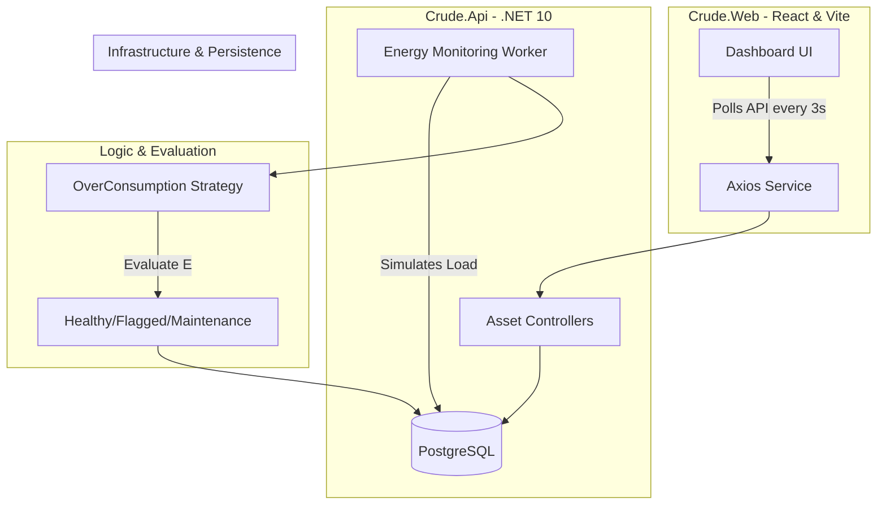

# CRUDE Power Grid Monitor ⚡

A full-stack industrial energy asset management system designed to monitor, evaluate, and flag power grid components in real-time.

## 🏗 The CRUDE Architecture
This project implements the **CRUDE** lifecycle:
* **C**reate: Add new energy assets (Transformers, Pumps, Drills) to the grid.
* **R**ead: Live-stream consumption data via a React dashboard.
* **U**pdate: Synchronize asset status across the database.
* **D**elete: Decommission assets from the active monitor.
* **E**valuate: **The Core Logic.** A C# Background Service evaluates load data every 3 seconds to determine if a machine is Healthy, Flagged, or requiring Maintenance.

## 🏗 The CRUDE Architecture & High Level Design (HLD)
This project implements the **CRUDE** lifecycle:
* **C**reate: Add new energy assets (Transformers, Pumps, Drills) to the grid.
* **R**ead: Live-stream consumption data via a React dashboard.
* **U**pdate: Synchronize asset status across the database.
* **D**elete: Decommission assets from the active monitor.
* **E**valuate: **The Core Logic.** A C# Background Service evaluates load data every 3 seconds to determine if a machine is Healthy, Flagged, or requiring Maintenance.



## 🚀 Tech Stack
- **Frontend:** React (Vite), TypeScript, Tailwind CSS, Axios.
- **Backend:** .NET 10 Web API, Entity Framework Core.
- **Database:** PostgreSQL (via Docker on Mac).
- **Background Logic:** C# Hosted Services for real-time sensor simulation.

## 🛠 Features
- **Live Feed:** Real-time polling showing kW load fluctuations.
- **4-State Logic:** Automatic status transitions between Healthy, Warning, Flagged, and Maintenance.
- **Industrial UI:** Dark-themed dashboard optimized for high-contrast monitoring environments.

## 🚦 Getting Started
1. **Database:** Ensure PostgreSQL is running (Docker).
2. **API:** Run `dotnet run --project Crude.Api`.
3. **Web:** Run `npm install` and `npm run dev` in the `Crude.Web` folder.

## 🚀 Tech Stack
- **Frontend:** React (Vite), TypeScript, Tailwind CSS, Axios.
- **Backend:** .NET 10 Web API, Entity Framework Core.
- **Database:** PostgreSQL (via Docker on Mac).
- **Background Logic:** C# Hosted Services for real-time sensor simulation.

## 🛠 Features
- **Live Feed:** Real-time polling showing kW load fluctuations.
- **4-State Logic:** Automatic status transitions between Healthy, Warning, Flagged, and Maintenance.
- **Industrial UI:** Dark-themed dashboard optimized for high-contrast monitoring environments.

## 🚦 Getting Started
1. **Database:** Ensure PostgreSQL is running (Docker).
2. **API:** Run `dotnet run --project Crude.Api`.
3. **Web:** Run `npm install` and `npm run dev` in the `Crude.Web` folder.

## 🧪 Testing
The project includes a suite of unit tests to verify the core evaluation logic.
To run the tests, use the following command in the root directory:
```bash
dotnet test
```
## 📷 Output Screenshot:


